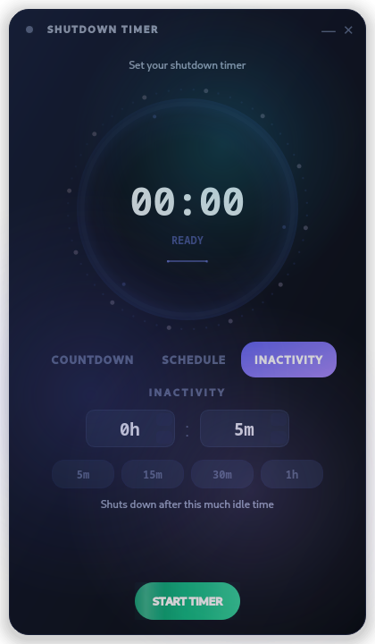

# SchedShutTimer

A heavily animated shutdown timer for Linux with a premium dark UI. Set a countdown or schedule a shutdown time with smooth animations and live visual feedback.

## Features

- **Countdown mode** — set hours, minutes, seconds with quick presets (5m, 15m, 30m, 1h)
- **Schedule mode** — pick a specific time for the system to shut down
- **System tray** — minimizes to tray with a custom icon and remaining time tooltip
- **Dark theme** — rich gradient-based dark UI with pill-shaped mode tabs and glass-morphism container

## Screenshots



## Installation

```bash
git clone https://github.com/Goodborn/schedshuttimer.git
cd schedshuttimer
./install.sh
```

Installs into a private virtual environment under `~/.local/share/shutdown-timer`,
with the `shutdown-timer` command and an app-launcher shortcut added to your
user account. No `sudo`, no system packages, nothing touches system
directories — works the same on any distro with Python 3.10+. Run it again
any time to pick up a `git pull`.

### Arch Linux (AUR)

<!-- Add AUR instructions once published -->

## Usage

```bash
shutdown-timer
```

Or directly from the source:

```bash
python -m shutdown_timer
```

### Setting a countdown

1. Select **COUNTDOWN** mode
2. Adjust hours, minutes, and seconds using the spinboxes or click a preset button
3. Click **START TIMER**
4. To cancel, click **CANCEL**

### Scheduling a shutdown

1. Select **SCHEDULE** mode
2. Pick the target shutdown time
3. Click **START TIMER**

- The app stays on top of other windows
- Close button minimizes to system tray
- The timer runs even when minimized

## How it works

SchedShutTimer triggers a system shutdown via the `org.freedesktop.login1` D-Bus interface when `dbus-python` is available, falling back to `systemctl poweroff` otherwise — either way, no password is required on an active desktop session. Your system must be using systemd-logind (default on modern Linux distributions including Arch, Fedora, Ubuntu, etc.).

**DE-agnostic** — works on KDE, GNOME, Hyprland, Sway, XFCE, and any other Linux desktop.

## Dependencies

- Python 3.10+
- PyQt6 (installed automatically by `install.sh` into its own venv)
- dbus-python (optional — only needed for the D-Bus shutdown path instead of `systemctl`)

## Building

### PKGBUILD (Arch Linux)

```bash
makepkg -si
```

## License

MIT
